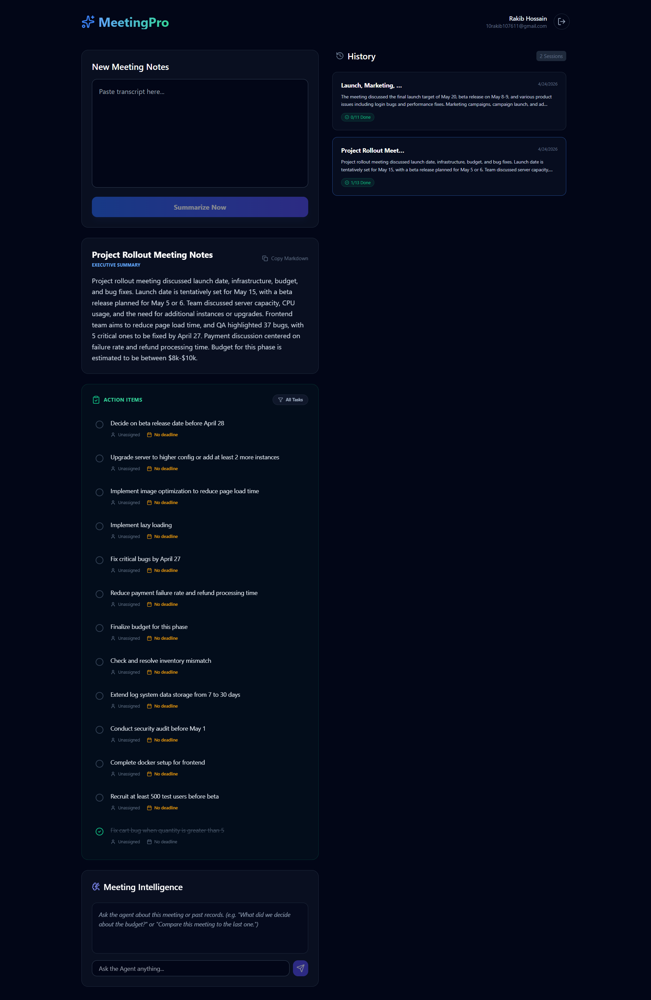

# 🎙️ MeetingPro: AI Meeting Productivity Suite

[](https://opensource.org/licenses/ISC)
[](https://reactjs.org/)
[](https://firebase.google.com/)
[](https://groq.com/)

An enterprise-grade, full-stack application designed to streamline meeting productivity. By leveraging high-performance Large Language Models (LLMs), this tool transforms verbose meeting transcripts into actionable insights, professional summaries, and structured task lists in seconds.



---

## ✨ Core Features

- **🤖 Agentic Meeting Intelligence:** A context-aware chat assistant that queries your entire meeting history.
- **⚡ Lightning-Fast Summarization:** Powered by Groq's Llama 3.3 model for near-instant processing.
- **📅 Smart Task Management:** Automatic extraction of Assignees, Deadlines, and professional Meeting Titles.
- **✅ Interactive Action Tracking:** Real-time task checklists with persistent state in Firestore.
- **🛠️ AI Database Actions:** Give natural language commands (e.g., "Change the title") to update records automatically.
- **🛡️ Safe Delete Workflow:** Agentic deletions with human-in-the-loop confirmation for data safety.
- **📋 Professional Export:** One-click Markdown export for Slack, Notion, and Jira.
- **🔄 Real-time Persistence:** Seamless synchronization and interactive history tracking.
- **🔐 Secure Access:** Enterprise-ready authentication via Firebase Auth and Google OAuth 2.0.
- **🌗 Premium UI/UX:** A state-of-the-art "Obsidian" dark-mode interface with Lucide iconography.

---

## 🏗️ System Architecture

The application follows a modern serverless architecture designed for high availability and low latency:

1.  **Frontend (Client):** A React-based Single Page Application (SPA) featuring an **Agentic Dispatcher** that translates AI intents into database actions.
2.  **API Layer (Serverless):** An Express.js backend wrapped in Firebase Cloud Functions. It implements a **Retrieval-Augmented Generation (RAG)** pattern for meeting history.
3.  **AI Inference (Groq):** High-speed LLM processing using the OpenAI-compatible Groq API to run Llama 3.3 70B models.
4.  **Database (Firestore):** A NoSQL real-time database that stores meeting titles, summaries, and structured task objects.

---

## 📊 Database Schema (Firestore)

The project utilizes a flat, efficient NoSQL structure optimized for real-time queries.

### `summaries` Collection
| Field | Type | Description |
| :--- | :--- | :--- |
| `id` | `string` | Auto-generated Document ID. |
| `userId` | `string` | The Firebase UID of the owner. |
| `title` | `string` | AI-generated professional title for the meeting. |
| `rawNotes` | `string` | The original transcript/notes input. |
| `summary` | `string` | The AI-generated summary content. |
| `actionItems` | `array<obj>` | List of tasks with `text`, `assignee`, `deadline`, and `completed` status. |
| `createdAt` | `timestamp` | Server-side timestamp for chronological sorting. |

---

## 🎨 User Interface & Experience

The application features a sleek, professional "Obsidian" dark-mode theme:
- **Dashboard:** A split-pane view with a focused input area on the left and a rich history sidebar on the right.
- **Agent Intelligence:** Integrated chat panel for interacting with the Meeting Intelligence Agent.
- **Micro-Animations:** Subtle transitions and loading states (Tailwind CSS + `tailwindcss-animate`).
- **Responsive Design:** Fully optimized for Mobile, Tablet, and Desktop workflows.

---

## 🤖 Agentic Intelligence & Tool Use

MeetingPro implements a sophisticated **Agentic Workflow** where the AI can perform actions on behalf of the user:

### Intent Recognition
The system uses Llama 3.3 to analyze user messages for specific intents:
- **`UPDATE_TITLE`**: Automatically renames meetings based on conversation context.
- **`UPDATE_TASK`**: Toggles task completion status via natural language.
- **`DELETE_MEETINGS`**: Identifies and targets records for removal.

### Human-in-the-Loop Safety
To ensure data integrity, destructive actions (like deletion) are not executed directly. Instead, the Agent generates a **Pending Action**, which requires a manual user confirmation in the UI before any database modification occurs.

---

## 🛠️ Tech Stack

### Frontend
- **Framework:** [React 18](https://reactjs.org/) (Vite)
- **Styling:** [Tailwind CSS](https://tailwindcss.com/)
- **State Management:** React Context API + Hooks
- **Icons:** [Lucide React](https://lucide.dev/)

### Backend
- **Runtime:** [Node.js](https://nodejs.org/)
- **Framework:** [Express.js](https://expressjs.com/)
- **Cloud:** [Firebase Cloud Functions v2](https://firebase.google.com/docs/functions)

### Infrastructure & Services
- **Auth:** [Firebase Authentication](https://firebase.google.com/docs/auth)
- **Database:** [Cloud Firestore](https://firebase.google.com/docs/firestore)
- **Hosting:** [Firebase Hosting](https://firebase.google.com/docs/hosting)
- **AI Inference:** [Groq Cloud](https://groq.com/) (Llama-3.3-70b-versatile)

---

## 🚀 Getting Started

### 1. Environment Configuration

#### Backend (`/Backend/.env`)
```env
OPENAI_API_KEY=gsk_your_groq_key
PORT=5000
```

#### Frontend (`/Frontend/.env`)
```env
VITE_FIREBASE_API_KEY=...
VITE_FIREBASE_AUTH_DOMAIN=...
VITE_FIREBASE_PROJECT_ID=...
VITE_FIREBASE_STORAGE_BUCKET=...
VITE_FIREBASE_MESSAGING_SENDER_ID=...
VITE_FIREBASE_APP_ID=...
VITE_API_URL=http://localhost:5000
```

### 2. Local Development

```bash
# Install dependencies
cd Backend && npm install
cd ../Frontend && npm install

# Start Backend
cd Backend && npm start

# Start Frontend
cd ../Frontend && npm run dev
```

### 3. Deployment

```bash
# Build Frontend
cd Frontend && npm run build

# Deploy to Firebase
cd ..
firebase deploy
```

---

## 📄 License

This project is licensed under the **ISC License**. See the [LICENSE](LICENSE) file for details.
